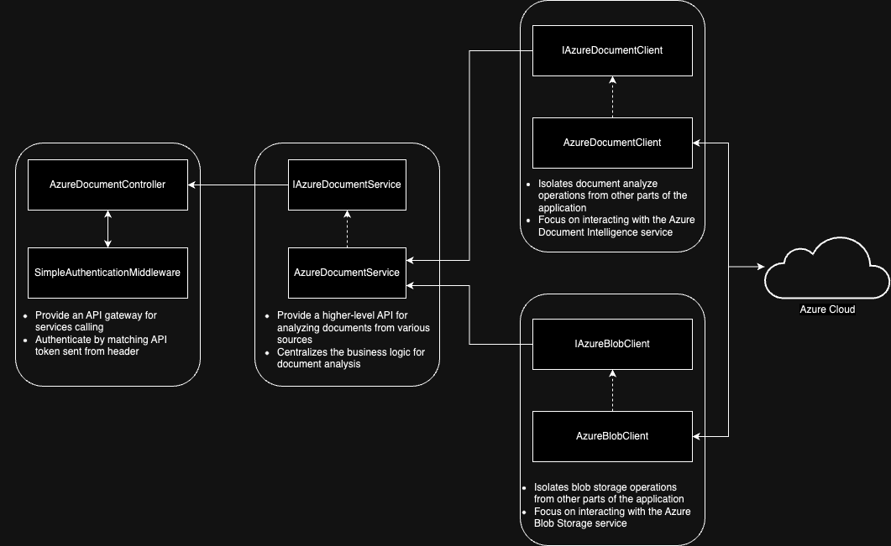

# Slip Intelligence



## Port

- HTTP: `5202`
- HTTPS: `7131`

## Authorization

- Bearer Token: `6EE61404E63A678D6CE96FF308A13BD6F5040D8F`

## API Directory

- `<YOUR_URL>:<PORT>/api/AzureDocument/base64/<YOUR_MODEL_ID>`: Send document via base64

  Body `raw`:

  ```
  {
     "base64Document": "<YOUR_BASE64_STRING>"
  }
  ```

- `<YOUR_URL>:<PORT>/api/AzureDocument/bytes/<YOUR_MODEL_ID>`: Send document via byte array

  Body `form-data`:

  ```
  {
     "document": "<YOUR_FILE>"
  }
  ```

- `<YOUR_URL>:<PORT>/api/AzureDocument/uri/<YOUR_MODEL_ID>`: Send document via URI

  Body `raw`:

  ```
  {
     "uriDocument": "<YOUR_URI_STRING>"
  }
  ```

- `<YOUR_URL>:<PORT>/api/AzureDocument/azure-blob/<YOUR_MODEL_ID>`: Send document via Azure Blob object

  Body `raw`:

  ```
  {
     "containerName": "<YOUR_CONTAINER_NAME>",
     "blobName": "<YOUR_BLOB_NAME>"
  }
  ```

## Response

```
{
    "status": {
        "code": 1000,
        "description": "Success."
    },
    "data": {
        "success": true,
        "apiVersion": "2023-07-31",
        "modelId": "slip-intelligence-002",
        "content": "...",
        "fields": {
            "SlipBank": {
                "content": "ธนาคารกสิกรไทย KASIKORNBANK",
                "confidence": 0.601
            },
            ...
        }
    }
}
```

**Description**

- `success`: `bool`, Indicate if service can connect to Azure or able to extract data or not
- `apiVersion`: `str`, Azure Document Intelligence model's API Version
- `modelId`: `str`, ID of Azure Document Intelligence model
- `content`: `str`, All of the string in document that model can extract
- `fields`: `Dictionary<string, Field>`, All of the field that model can extract
  - `key`: Name of field
  - `Field`
    - `content`: Content of field
    - `confidence`: Model confidence ratio range from 0 - 1

**Field**

- `slipBank`: Bank name at the head of slip/cheque
- `referenceNumber`: Slip/cheque/transaction reference number
- `amount`: Transfer amount
- `transactionDateTime`: Transaction date/datetime
- `senderAccountNumber`: Bank Account Number of sender
- `senderName`: Name of sender
- `senderBank`: Bank of sender
- `receiverAccountNumber`: Bank Account Number of receiver
- `receiverName`: Name of receiver
- `receiverBank`: Bank of receiver
- `currency`: Currency found in document
